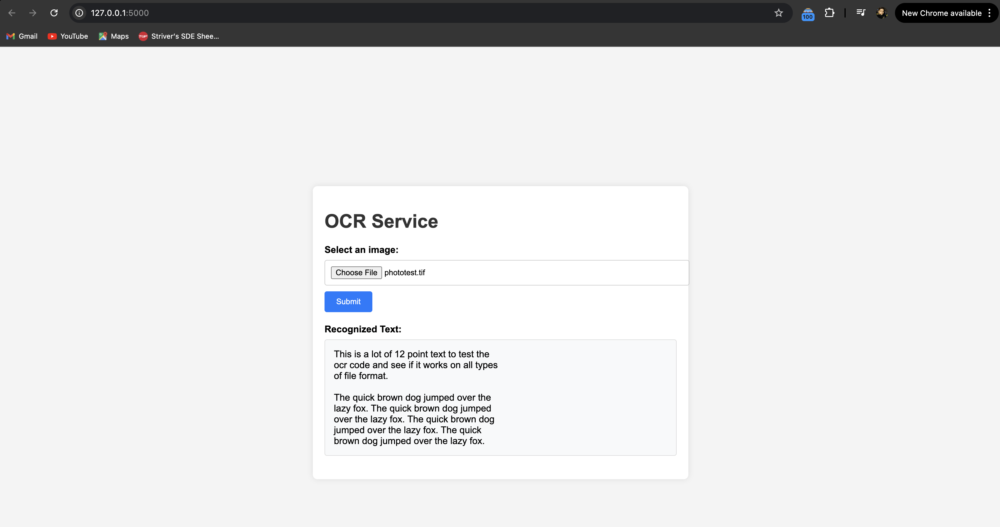

# Project_Mercari

## Overview
Project_OCR is an Optical Character Recognition (OCR) service built with Flask, Celery, and Redis. This application allows users to submit images, processes them using Tesseract OCR, and retrieves the extracted text. It includes a simple web frontend and a backend service that handles OCR tasks asynchronously.

## Features
- **OCR Service:** Extracts text from images using Tesseract OCR.
- **Frontend:** Simple interface for submitting images.
- **Asynchronous Processing:** Utilizes Celery with Redis for background task processing.

## Screenshots
### Application Interface


### Sample Image for OCR


## API Endpoints
- `POST /image-sync`: Processes the image synchronously.
- `POST /image`: Submits the image for asynchronous processing.
- `GET /image/<task_id>`: Retrieves the status and result of the asynchronous OCR task.

## Requirements
- Docker
- Docker Compose
- Python 3.x
- Tesseract OCR

## API Usage
You can use tools like Postman to interact with the API endpoints. The frontend supports image conversion to Base64, facilitating easy testing of image uploads and OCR processing.

### Image Conversion
To manually test the API, convert images to Base64 format using the provided `base_64.py` script or through the frontend interface.

#### Using `base_64.py` Script
1. **Update the Script:** Open the `base_64.py` file and set the image file path in the `IMAGE_PATH` variable.
2. **Run the Script:** Execute the `base_64.py` script to convert your image to Base64 format.
   ```bash
   python base_64.py
   ```
3. **Script Output:** The script will output the Base64 encoded string of the image. Copy this string for use in API requests.

### API Endpoints

#### Synchronous OCR Processing
- **Endpoint:** `POST /image-sync`
- **Request Body:**
  ```json
  {
    "image_data": "<base64_encoded_image>"
  }
  ```
- **Response:**
  ```json
  {
    "text": "Extracted text from image."
  }
  ```

#### Asynchronous OCR Processing
- **Endpoint:** `POST /image`
- **Request Body:**
  ```json
  {
    "image_data": "<base64_encoded_image>"
  }
  ```
- **Response:**
  ```json
  {
    "task_id": "<task_id>"
  }
  ```

#### Retrieve Task Result
- **Endpoint:** `GET /image/<task_id>`
- **Response:**
  ```json
  {
    "task_id": "<task_id>",
    "status": "SUCCESS",
    "text": "Extracted text from image."
  }
  ```

## Code Explanation
- **app.py:** Main application file with Flask routes and Celery task configuration.
- **Dockerfile:** Defines the Docker image for the Flask application.
- **docker-compose.yml:** Defines the Docker Compose configuration for Redis, Celery, and the Flask app.
- **Frontend:** Located in `templates/index.html` and the `static/` directory.

## Testing
### Running Tests
Use tools like Postman to test the API endpoints by sending image data in Base64 format.

### Running the Project Locally
To run Project_OCR in your local environment, follow these steps:

1. **Activate the Python Virtual Environment:**
   ```bash
   source venv/bin/activate
   ```
2. **Install the Project Dependencies:**
   ```bash
   pip install -r requirements.txt
   ```
3. **Run the Redis Server:**
   ```bash
   redis-server
   ```
4. **Start the Celery Worker:**
   ```bash
   celery -A app.celery worker --loglevel=info
   ```
5. **Run the Flask Application:**
   ```bash
   python app.py
   ```

## License
This project is licensed under the MIT License - see the [LICENSE](LICENSE) file for details.

## Acknowledgments
- [Flask](https://flask.palletsprojects.com/)
- [Celery](https://docs.celeryproject.org/)
- [Redis](https://redis.io/)
- [Tesseract OCR](https://github.com/tesseract-ocr/tesseract)

